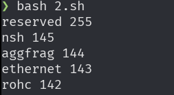
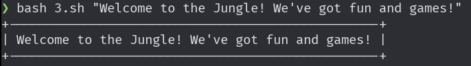
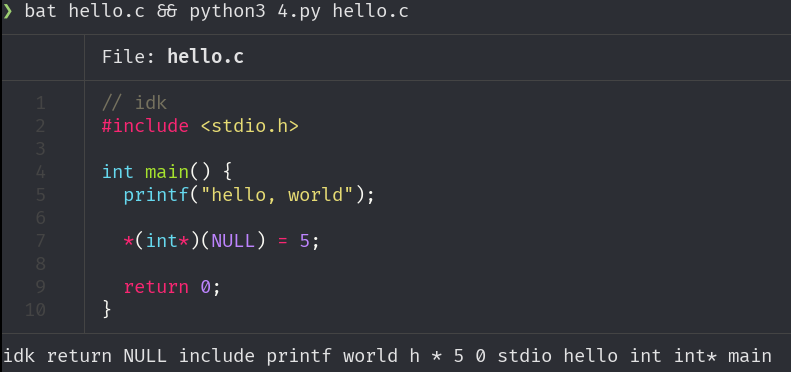
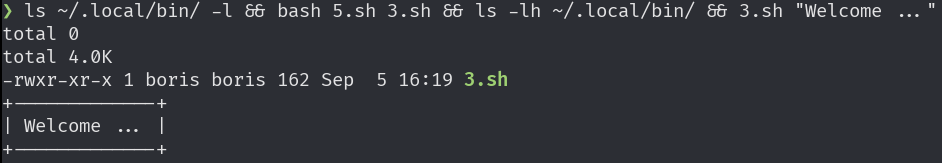
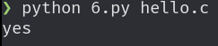
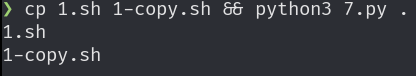
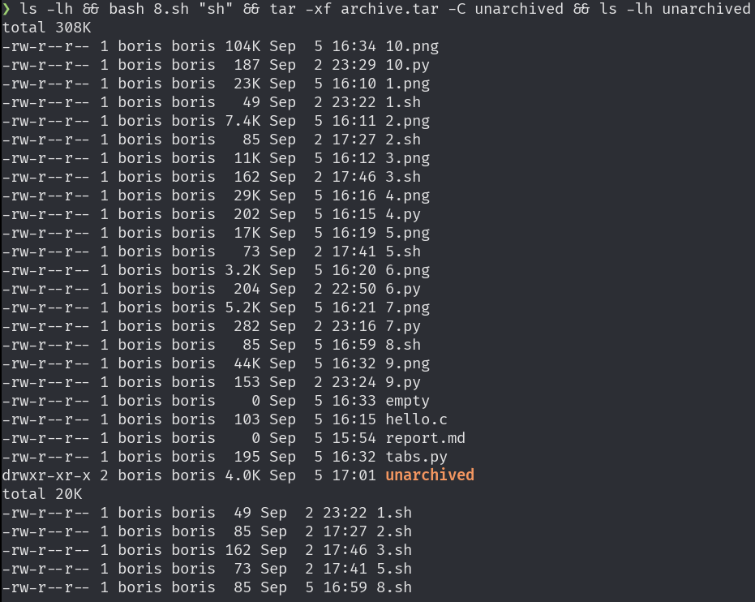
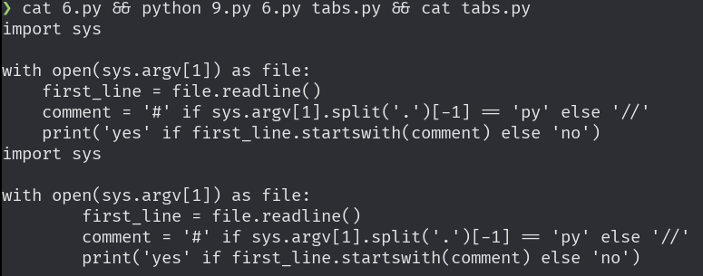
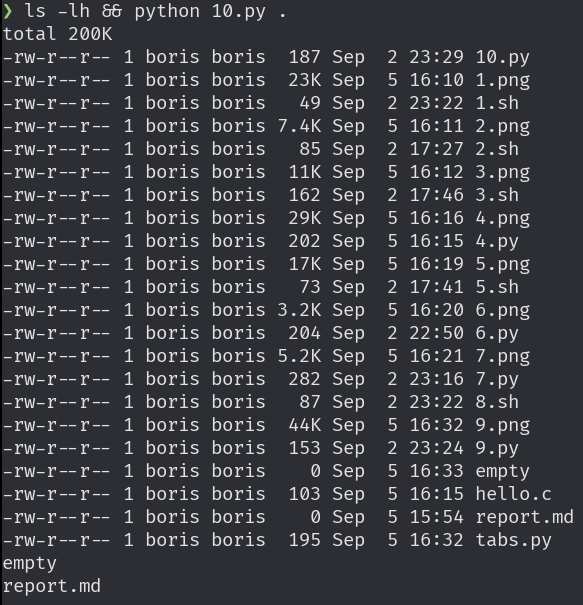

# Задание 1
```bash
#!/usr/bin/env bash
cut -d ':' -f1 < /etc/passwd
```


# Задание 2
```bash
#!/usr/bin/env bash
tac < /etc/protocols | tr -s ' ' | cut -d ' ' -f 2,1 | head -n 5
```


# Задание 3
```bash
#!/usr/bin/env bash
message=$1

line () {
  echo -n '+'
  for ((i=0; i < ${#message} + 2; i++)); do echo -n '-'; done
  echo '+'
}

line
echo "| $message |"
line
```


# Задание 4
```python
import sys

with open(sys.argv[1], 'r') as file:
    string = file.read()

    for char in '\n;"(){},.#<>!/=':
        string = string.replace(char, ' ')

    print(" ".join(list(set(string.split()))))
```


# Задание 5
```bash
#!/usr/bin/env bash
cp "$1" ~/.local/bin/
chmod +x "$HOME/.local/bin/$1"
```


# Задание 6
```python
import sys

with open(sys.argv[1]) as file:
    first_line = file.readline()
    comment = '#' if sys.argv[1].split('.')[-1] == 'py' else '//'
    print('yes' if first_line.startswith(comment) else 'no')
```


# Задание 7
```python
import filecmp
import pathlib
import sys
import os

paths = list(filter(os.path.isfile, pathlib.Path(sys.argv[1]).rglob("*")))

for path1 in paths:
    count = 0

    for path2 in paths:
        count += 1 if filecmp.cmp(path1, path2) else 0

    if count > 1:
        print(path1)
```


# Задание 8
```bash
#!/usr/bin/env bash
tar -cf archive.tar $(find . -name "*.$1" -type f | tr '\n' ' ')
```


# Задание 9
```python
import sys

with open(sys.argv[1], 'r') as input, open(sys.argv[2], 'w') as output:
    text = input.read().replace("    ", "\t")
    output.write(text)
```


# Задание 10
```python
import pathlib
import sys
import os

paths = list(filter(os.path.isfile, pathlib.Path(sys.argv[1]).rglob("*")))

for file in paths:
    if os.stat(file).st_size == 0:
        print(file)
```

