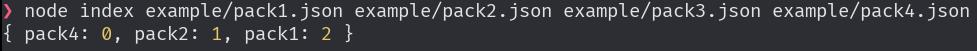

# Запуск решения

Для запуска потребуется `node.js` версии 20 или выше.

Примеры метаданных, по которым строится порядок установки зависимостей есть в дериктории `examples/`.

Для запуска нужно в аргументах перечислить `json`-файлы пакетов, где первым является файл зависимости, для которого и нужно решить. Например:
```bash
node index example/pack1.json example/pack2.json example/pack3.json example/pack4.json
```
выведет:
```
{ pack4: 0, pack2: 1, pack1: 2 }
```

Результат работы:

