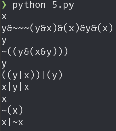

# Задание 1
```jsonnet
local Group(digits) = 'ИКБО-' + digits;

local groups = [
  Group(i + '-20')
  for i in std.range(1, 24)
] + [
  Group('10-23'),
];

local Student(age, groupId, name) = {
  age: age,
  group: groups[groupId],
  name: name,
};

{
  groups: groups,
  students: [
    Student(19, 3, 'Иванов И.И.'),
    Student(18, 4, 'Петров П.П.'),
    Student(18, 4, 'Сидоров С.С.'),
    Student(19, std.length(groups) - 1, 'Бузин Б.А.'),
  ],
  subject: 'Конфигурационное управление',
}
```


# Задание 2
```dhall
let List/map =
      https://prelude.dhall-lang.org/v23.0.0/List/map

let List/drop =
      https://prelude.dhall-lang.org/v23.0.0/List/drop

let List/index =
      https://prelude.dhall-lang.org/v23.0.0/List/index

let Natural/enumerate =
      https://prelude.dhall-lang.org/v23.0.0/Natural/enumerate

let Range =
      \(n : Natural) ->
      \(m : Natural) ->
        List/drop n Natural (Natural/enumerate (m + 1))

let Group = \(n : Text) -> "ИКБО-" ++ n

let groups =
        List/map
          Natural
          Text
          (\(i : Natural) -> Group (Natural/show i ++ "-20"))
          (Range 1 24)
      # [ Group "10-23" ]

let Student =
      \(age : Natural) ->
      \(groupId : Natural) ->
      \(name : Text) ->
        { age, group = List/index groupId Text groups, name }

in  { groups
    , students =
      [ Student 19 3 "Иванов И.И."
      , Student 18 4 "Петров П.П."
      , Student 18 4 "Сидоров С.С."
      , Student 19 (Natural/subtract 1 (List/length Text groups)) "Бузин Б.А."
      ]
    }
```


# Задание 3
```python
import random


def parse_bnf(text):
    '''
    Преобразовать текстовую запись БНФ в словарь.
    '''
    grammar = {}
    rules = [line.split('=') for line in text.strip().split('\n')]
    for name, body in rules:
        grammar[name.strip()] = [alt.split() for alt in body.split('|')]
    return grammar


def generate_phrase(grammar, start):
    '''
    Сгенерировать случайную фразу.
    '''
    if start in grammar:
        seq = random.choice(grammar[start])
        return ''.join([generate_phrase(grammar, name) for name in seq])
    return str(start)


BNF = '''
word = 0 | 1 | word word
'''

for i in range(10):
    print(generate_phrase(parse_bnf(BNF), 'word'))
```


# Задание 4
```python
import random


def parse_bnf(text):
    '''
    Преобразовать текстовую запись БНФ в словарь.
    '''
    grammar = {}
    rules = [line.split('=') for line in text.strip().split('\n')]
    for name, body in rules:
        grammar[name.strip()] = [alt.split() for alt in body.split('|')]
    return grammar


def generate_phrase(grammar, start):
    '''
    Сгенерировать случайную фразу.
    '''
    if start in grammar:
        seq = random.choice(grammar[start])
        return ''.join([generate_phrase(grammar, name) for name in seq])
    return str(start)


BNF = '''
seq = () | {} | ( seq ) | { seq } | seq seq
'''

for i in range(10):
    print(generate_phrase(parse_bnf(BNF), 'seq'))
```


# Задание 5
```python
import random


def parse_bnf(text):
    '''
    Преобразовать текстовую запись БНФ в словарь.
    '''
    grammar = {}
    rules = [line.split('=') for line in text.strip().split('\n')]
    for name, body in rules:
        grammar[name.strip()] = [alt.split() for alt in body.split('/')]
    return grammar


def generate_phrase(grammar, start):
    '''
    Сгенерировать случайную фразу.
    '''
    if start in grammar:
        seq = random.choice(grammar[start])
        return ''.join([generate_phrase(grammar, name) for name in seq])
    return str(start)


BNF = '''
expr = x / y / ( expr ) / ~ expr / expr & expr / expr | expr
'''

for i in range(10):
    print(generate_phrase(parse_bnf(BNF), 'expr'))
```


