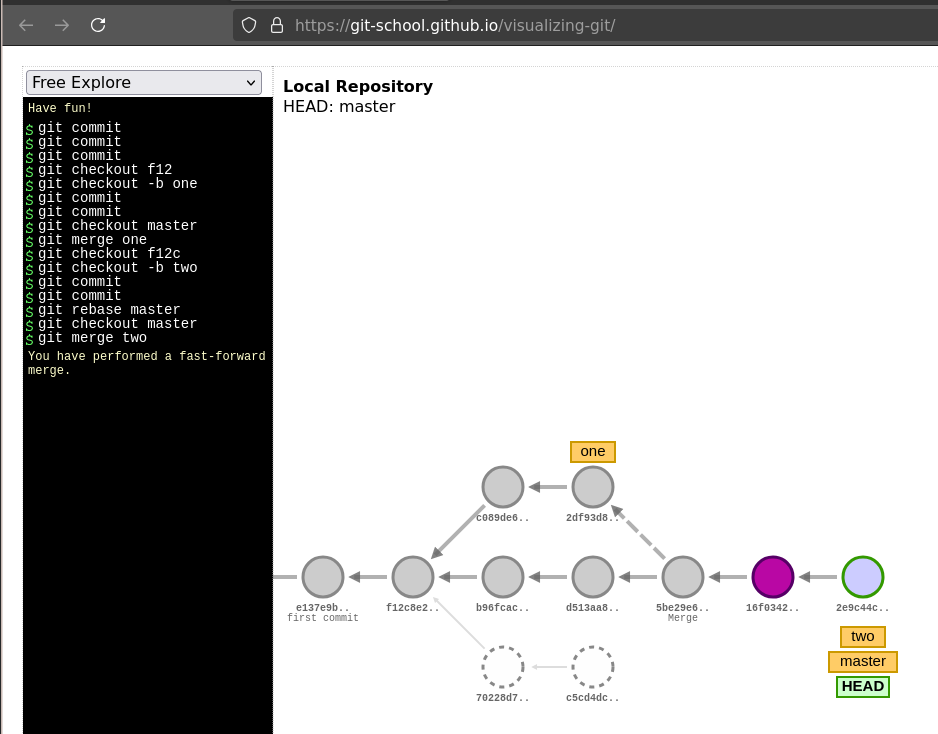
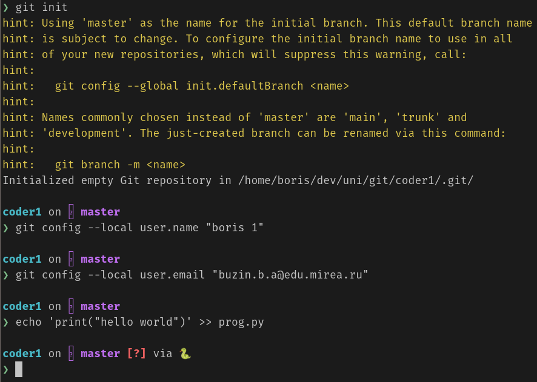
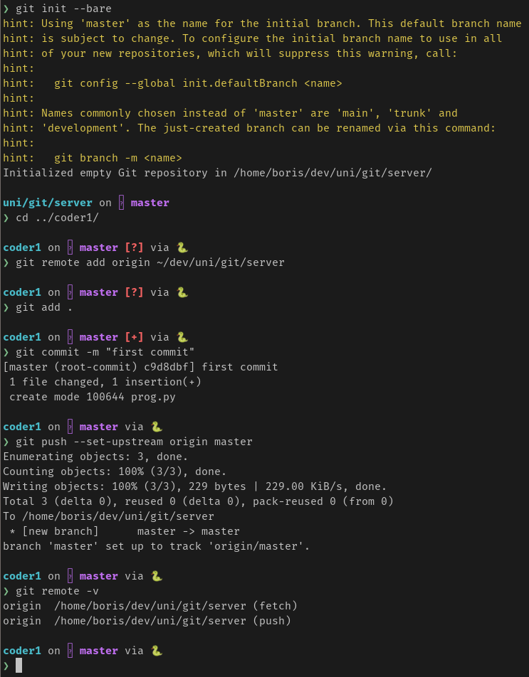
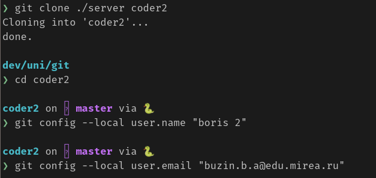
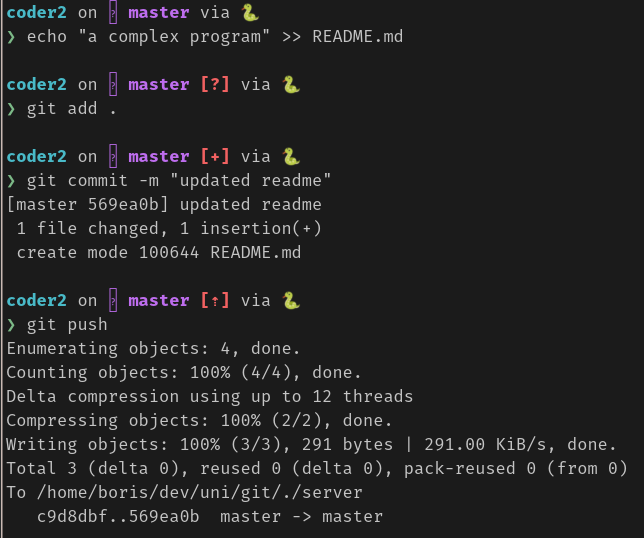
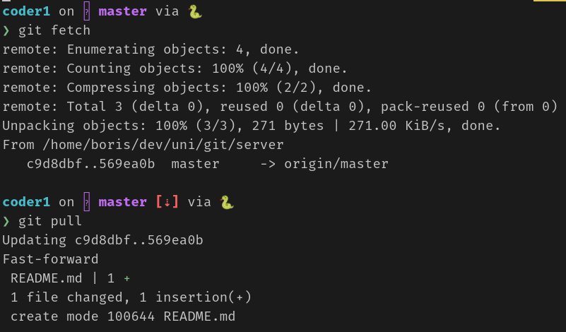
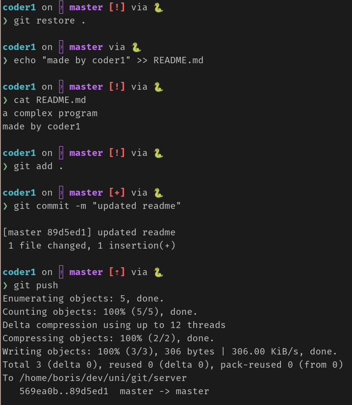
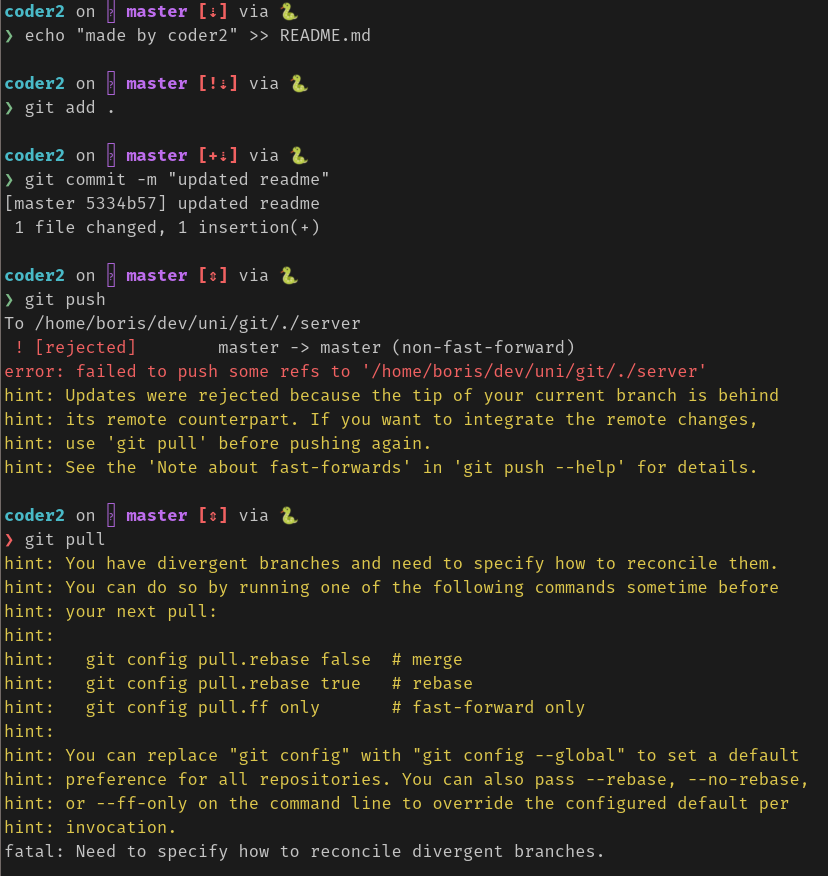
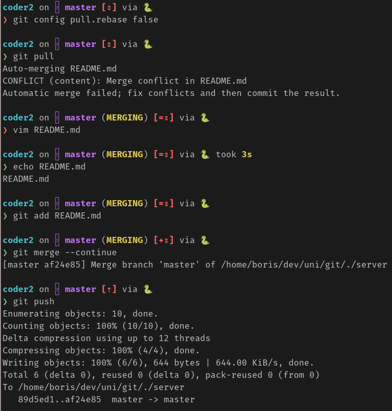
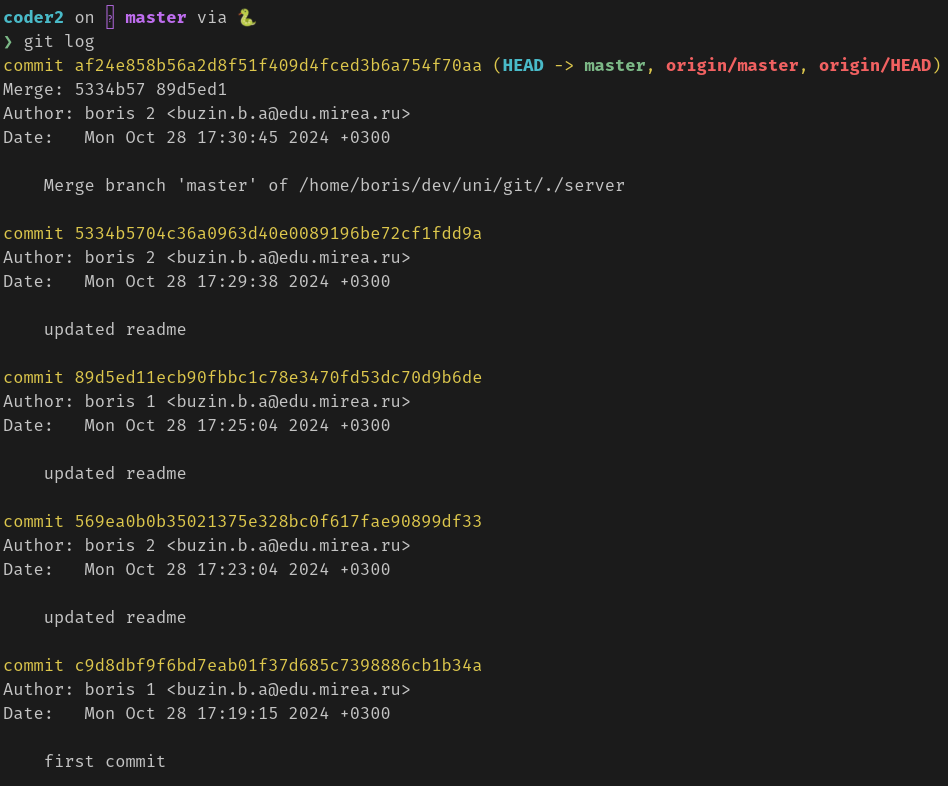

# Задание 1

# Задание 2

# Задание 3

Создание bare репозитория и коммит в него из локального репозитория.

Клонирование репозитория.

Пуш в README.md в репозиторий.

Обновление репозитория.

Добавление информации об авторе в README.md.

Попытка обновить README.md вторым пользователем.

Разрешение конфликта.

Итоговый лог.

