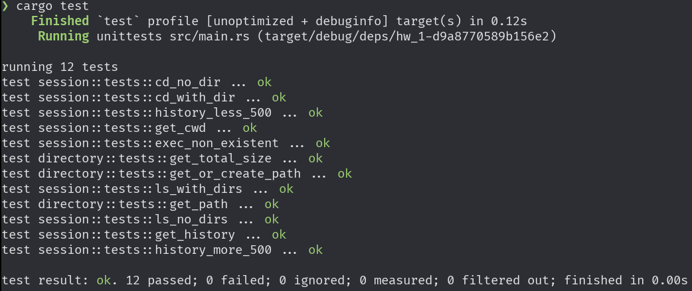

# Общее описание

Примитивный эмулятор терминала для ОС. Написанный на языке Rust с применением фреймворка iced.

# Функции и настройки
## Доступные команды

```
ls
```
Выведет содержимое текущей дериктории.

```
cd dir/
```
Перейдет в дерикторию `dir`, если такая существует.

```
du
```
Выведет использование диска в байтах текущей дериктории и вложенных дериктори.

```
exit
```
Завершит выполнение программы.

```
history
```
Выведет последние 500 введенных команд.

## Аргументы командной строки

Первым аргументом принимает `.tar` архив, используемый для построения файловой системы.
Вторым аргументом принимает путь до `.csv` файла, содержащего историю команд.
Третьим аргументом принимает путь до файла, содержащего команды, которые следует исполнить перед запуском эмулятора, разделенные переносом строки.

# Сборка проекта

Для сборки рекоммендуется использовать Rust версии 1.81. Для сборки в дебаг-режиме используется команда:
```bash
cargo build
```

Для сборки в релиз-режиме используется команда:
```
cargo build -r
```

# Результат запуска unit-тестов


