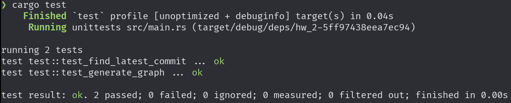
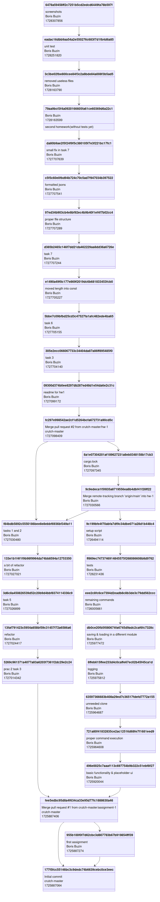

# Общее описание
Утилита для отображения дерева комитов в git-репозитории.

# Функции и настройки
## Аргументы командной строки
Первым аргументом принимает путь до анализируемого git-репозитория.
Вторым аргументом принимает unix-таймстамп даты, комиты ранее которой нужно отобразить.
Третьим аргументом принимает путь до файла с результирующим изображением.

# Сборка проекта
Для сборки рекоммендуется использовать Rust версии 1.81. Для сборки в дебаг-режиме используется команда:
```bash
cargo build
```

Для сборки в релиз-режиме используется команда:
```bash
cargo build -r
```

# Запуск
Помимо самой утилиы, для запуска нужен `mermaid-cli` для визуализации графа. Его можно установить командой:
```bash
npm i -g @mermaid-js/mermaid-cli
```

Для быстрого запуска в дебаг-режиме можно использовать команду:
```bash
cargo run
```

В этом случае аргументы нужно передать после `--`, например:
```bash
cargo run -- /path/to/repo 99999999999 out.png
```

# Результат запуска unit-тестов



# Пример результата работы утилиты


