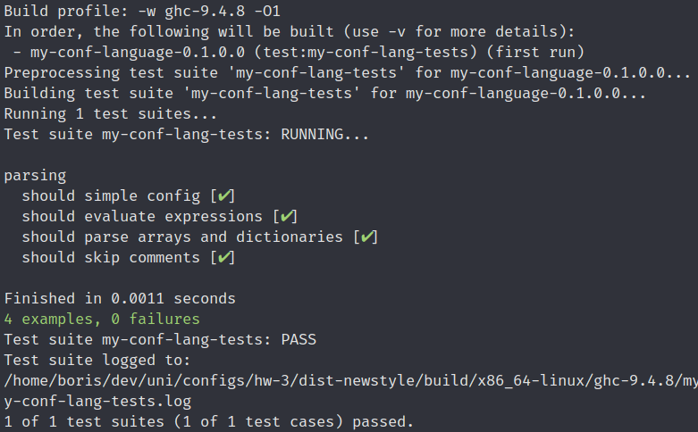

# Общее описание
Парсер для предельно простого языка конфигурации, написанный на Haskell.

## Синтаксис
```
#= Это комментарий =#
set str = "Это строчный литерал"
set num = 2 #= А это число =#

#=
В качестве значений можно использовать
другие значения из конфига
=#
set clone = num #= clone будет равен 2 =#

#=
Помимо копирования значений, с ними можно выполнять
выражения в постфиксной записи, например:
=#
set computed = ?[num clone * 1 +] #= computed будет равен 5 =#

set arr = array(1, num, 3)  #= Это массив =#
set dict = { key: str } #= А это словарь =#
```

Этот конфиг будет транслирован в следующее:

```xml
<config>
  <str>Это строчный литерал</str>
  <num>2</num>
  <clone>2</clone>
  <computed>5</computed>
  <arr>
    <entry>1</entry>
    <entry>2</entry>
    <entry>3</entry>
  </arr>
  <dict>
    <key>Это строчный литерал</key>
  </dict>
</config>
```

# Функции и настройки
## Аргументы командной строки
Первым аргументом ожидает путь до файла, содержащего исходный конфиг. Вторым аргументом принимает путь до файла, в который будет записан результат в формате XML.

# Сборка проекта
Для сборки проекта потребуется Cabal версии `3.12.1.0` и GHC версии `9.4.8`. Для сборки можно использовать следущюю команду:
```bash
cabal build
```

Бинарник в этом случае будет лежать где-то в директории `dist-newstyle/build/...`.

Для быстрого запуска можно использовать следущюю команду:
```bash
cabal run my-conf-lang -- first-arg.myconf second-arg.xml
```

# Результат запуска тестов

