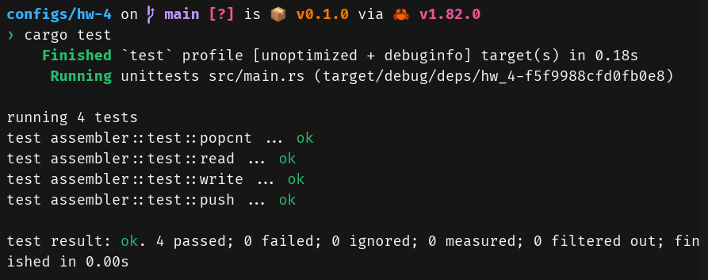

# Общее описание
Учебная виртульная машина.

# Функции и настройки
## Поддерживаемые команды
`PUSH X` - добавление элемента на стек.

`READ X` - чтение из ячейки по адресу X на вершину стека.

`WRITE X` - запись элемента с вершины стека в ячейку по адресу X.

`POPCNT` - снятие элемента с вершины стека и добавление вместо него числа, равного числу единиц в двоичной записи снятого числа.

Пример программы есть в файле `example.myasm`.

## Аргументы командной строки
Первым аргументов указывается действие: `assemble` или `interpret`.

### assemble
Далее указывются следующие аргументы: путь до файла с кодом, путь до бинарного файла, в который будет записан результат, путь до файла, в котором в формате JSON будет написано, какая команда в какой набор байт транслировалась.

### interpret
Далее указываются следующие аргументы: путь до бинарного файла, путь до файла, в котором в формате JSON будет записана память виртуальной машины после исполнения программы.

# Сборка проекта
Для сборки потребуется rustc версии 1.82 или выше. Для компиляции в релизном режиме используется команда:
```bash
cargo build -r
```

Для запуска unit-тестов используется команда:
```
cargo test
```

# Результат запуска тестов

